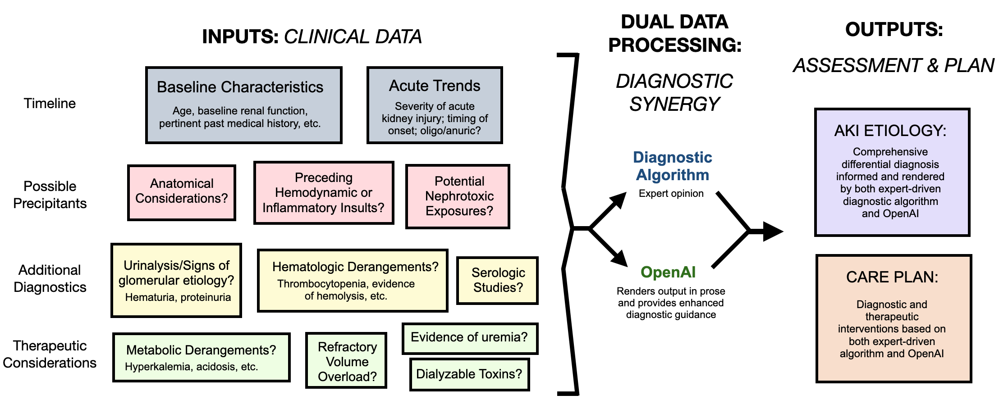
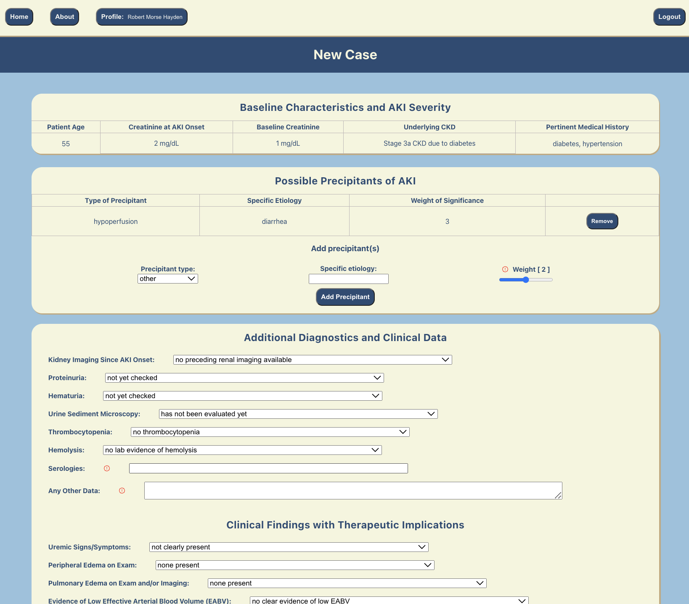
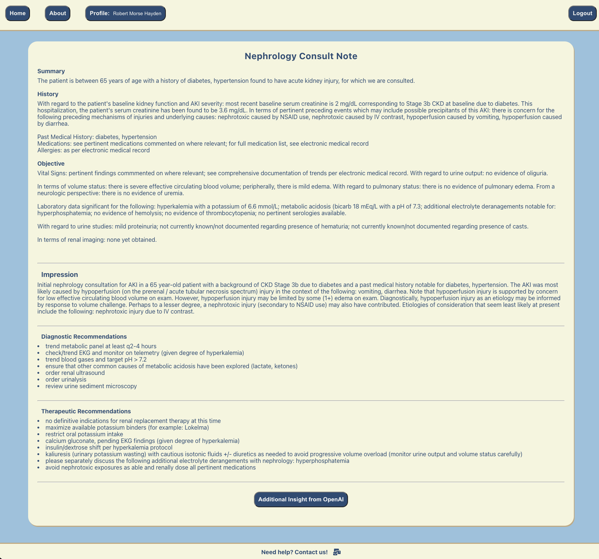
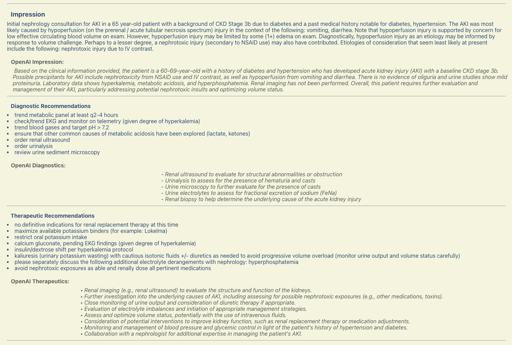

# Renal Consults

## INTRODUCTION

Motivated by a desire to improve patient care through the use of emerging AI technologies while drawing from our collective experiences across the full spectrum of patient-caregiving roles in the inpatient setting, we present a comprehensive web application that will aid nephrologists and other providers in the care of hospitalized patients with acute kidney injury (AKI). Relying on accurate data input from an experienced clinician, our web application will employ a dual data processing model comprised of 1) a hard-coded diagnostic algorithm based on expert opinion and 2) OpenAI in order to render both an impression of the patient's clinical presentation (including an extensive differential diagnosis)as well as a care plan that includes diagnostic tests for consideration and recommended therapeutic interventions (Figure 1).

FIGURE 1.  Flow of data through the web application

 

<!-- [GitHub Page](https://github.com/rmhayden/aki-consult) -->

## AI Integration
What sets us apart is our integration with OpenAI, which provides valuable insights into potentially missed differential diagnoses and concerns, enhancing your diagnostic capabilities. Join us on this journey to elevate your practice and provide the best care possible. Welcome to a new era of healthcare with AKI Consult.

(<a href="#readme-top">back to top</a>)

## Our Mission
We created the AKI Consult app because we believe that healthcare providers deserve a powerful tool that simplifies and enhances the process of generating consult summaries and diagnostic impressions. Our mission is to streamline the often complex and time-consuming task of compiling patient data into meaningful clinical notes. By harnessing the potential of technology and integrating OpenAI, we aim to empower healthcare professionals with the ability to provide more accurate, efficient, and comprehensive care to their patients. We envision a future where healthcare providers can focus more on patient interaction and treatment decisions, while AKI Consult handles the intricacies of data analysis and note generation. Our "why" is rooted in the commitment to improve healthcare delivery and make a tangible difference in the lives of both providers and patients.

(<a href="#readme-top">back to top</a>)

## User Experience

Create a new case and fill out all pertinent information:

A full consult note will be rendered, initially based on the nephrologist expert algorithm hard-coded into this application:

The user may then click on the "Additional Insight from OpenAI" button to add to the impression, diagnostic recommendations, and therapeutic recommendations:

(<a href="#readme-top">back to top</a>)

## Developers
- William Hu, RN - [LinkedIn](www.linkedin.com/in/william-wl-hu) | [GitHub](https://github.com/william-hu-codes)
- Robert Hayden, MD - [LinkedIn](https://www.linkedin.com/in/robert-m-hayden/) | [GitHub](https://github.com/rmhayden)

(<a href="#readme-top">back to top</a>)

## Built With
- 
- 
- 
- 
- 
- 
- 
- 
- 
- 
- 
- 
- 
- 

(<a href="#readme-top">back to top</a>)

## Roadmap
- [x] Sign up for new account (password is protected using bcrypt hashing)
- [x] Sign in with an existing account
- [x] View previously created patient cases associated with sign in account
- [x] Create new cases by submitting a clinical data form, designed and developed by specialist MD
- [x] Apply "weights" to clinical data 
- [ ] Edit existing cases
- [ ] Be able to create and access follow up progress notes based on new clinical data
- [ ] Customize the diagnosis building algo as appropriate
- [ ] rounded corners for authorization
- [ ] consistent box shadows 
- [ ] phos and other lab values incorporated
- [ ] navigation to error page for catch responses
- [ ] email
- [ ] additional log in route protection

(<a href="#readme-top">back to top</a>)

